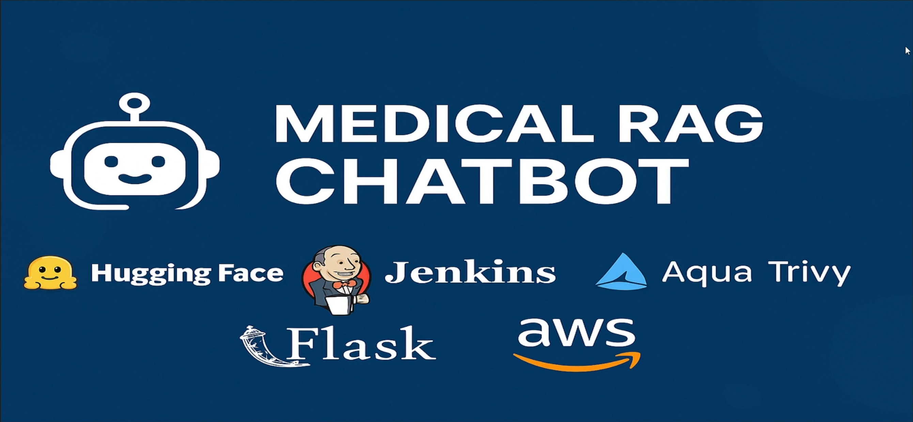
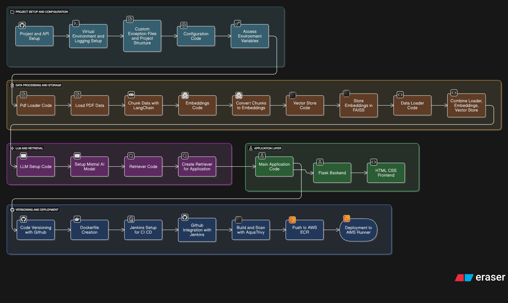

# 🏥 Medical RAG Chatbot

A production-oriented **Retrieval-Augmented Generation (RAG)** chatbot for medical document question answering, built with **LangChain, FAISS, Hugging Face, Flask, Docker, Jenkins, Trivy, AWS ECR, and AWS App Runner**.

This repository demonstrates an end-to-end **LLMOps pipeline** from local development to secure CI/CD deployment on AWS.

---

## 📌 Project Overview

This project implements a full RAG pipeline:

1. Ingest medical documents (PDFs)
2. Chunk and embed documents
3. Store embeddings in FAISS vector database
4. Retrieve relevant context for a query
5. Generate grounded answers using LLMs
6. Package with Docker
7. Run CI/CD using Jenkins
8. Scan images with Trivy
9. Push to AWS ECR
10. Deploy via AWS App Runner

---

## 🧰 Tools & Technologies

### 🧠 AI / LLM Stack
- Hugging Face (Embeddings / LLM)
- LangChain
- FAISS (Vector DB)

### 🧪 Backend
- Flask (API layer)

### ⚙️ DevOps / Deployment
- Docker
- Jenkins (CI/CD)
- Trivy (Security scanning)
- GitHub
- AWS ECR
- AWS App Runner

---

## 🖼️ Architecture

### 🔧 Tools Overview


### 🔄 Workflow


---

## 📁 Project Structure

```bash
medical-rag-chatbot/
├── app/
│   ├── main.py
│   ├── rag/
│   │   ├── ingest.py
│   │   ├── retriever.py
│   │   ├── embeddings.py
│   │   └── chain.py
│   ├── api/
│   │   └── routes.py
│   └── utils/
│       └── config.py
├── custom_jenkins/
│   └── Dockerfile
├── docs/
│   ├── medical_chatbot_tools_overview.png
│   └── medical_chatbot_workflow.png
├── Dockerfile
├── Jenkinsfile
├── requirements.txt
├── setup.py
├── .env
└── README.md
```

---

# 🔐 Environment Variables

Create a `.env` file:

```env
HF_TOKEN=your_huggingface_token
HUGGINGFACEHUB_API_TOKEN=your_token
```

⚠️ Never commit `.env` to GitHub.

---

# ⚙️ Setup Instructions

## 1️⃣ Clone Repository

```bash
git clone https://github.com/data-guru0/LLMOPS-2-TESTING-MEDICAL.git
cd LLMOPS-2-TESTING-MEDICAL
```

---

## 2️⃣ Create Virtual Environment

### Windows
```bash
python -m venv venv
venv\Scripts\activate
```

### Linux / WSL
```bash
python3 -m venv venv
source venv/bin/activate
```

---

## 3️⃣ Install Dependencies

```bash
pip install -e .
```

---

## 4️⃣ Run Locally

```bash
python app/main.py
```

---

# 🐳 Docker Setup

## Build Image
```bash
docker build -t medical-rag-chatbot .
```

## Run Container
```bash
docker run -p 5000:5000 --env-file .env medical-rag-chatbot
```

---

# 🔁 Jenkins CI/CD Setup

## Step 1: Build Jenkins Image

```bash
cd custom_jenkins
docker build -t jenkins-dind .
```

---

## Step 2: Run Jenkins

```bash
docker run -d --name jenkins-dind \
  --privileged \
  -p 8080:8080 -p 50000:50000 \
  -v /var/run/docker.sock:/var/run/docker.sock \
  -v jenkins_home:/var/jenkins_home \
  jenkins-dind
```

---

## Step 3: Get Password

```bash
docker logs jenkins-dind
```

Open:
```
http://localhost:8080
```

---

## Step 4: Install Python in Jenkins

```bash
docker exec -u root -it jenkins-dind bash
apt update
apt install -y python3 python3-pip
ln -s /usr/bin/python3 /usr/bin/python
exit
```

Restart:
```bash
docker restart jenkins-dind
```

---

# 🔗 GitHub Integration

1. Create GitHub token (repo + repo_hook)
2. Add credentials in Jenkins
3. Create Pipeline job
4. Use Jenkinsfile from repo
5. Run Build Now

---

# 🔍 Trivy Security Scan

Install inside Jenkins:

```bash
docker exec -u root -it jenkins-dind bash
curl -LO https://github.com/aquasecurity/trivy/releases/download/v0.62.1/trivy_0.62.1_Linux-64bit.deb
dpkg -i trivy_0.62.1_Linux-64bit.deb
exit
```

---

# ☁️ AWS ECR Setup

## 1. Create IAM User
- Policy: AmazonEC2ContainerRegistryFullAccess

## 2. Add Credentials in Jenkins

## 3. Install AWS CLI in Jenkins

```bash
docker exec -u root -it jenkins-dind bash
apt install -y unzip curl
curl "https://awscli.amazonaws.com/awscli-exe-linux-x86_64.zip" -o awscliv2.zip
unzip awscliv2.zip
./aws/install
exit
```

---

## 4. Create ECR Repository

Push Docker image via Jenkins pipeline.

---

# 🚀 AWS App Runner Deployment

## Steps:

1. Go to AWS → App Runner
2. Create Service
3. Source: ECR
4. Select image
5. Configure:
   - Port: 5000
   - CPU: 2 vCPU
   - Memory: 4GB
6. Add env variables:
   - HF_TOKEN
   - HUGGINGFACEHUB_API_TOKEN
7. Deploy

---

# 📊 Features

- Medical document QA
- Fast retrieval (<2s)
- Production-ready pipeline
- Secure container scanning
- Cloud deployment ready

---

# 🧹 Cleanup

```bash
docker system prune -a --volumes -f
```

---

# 🔒 Security Best Practices

- Never expose API keys
- Use `.env`
- Use IAM least privilege
- Rotate compromised keys

---

# 🚧 Future Improvements

- Add Load Balancer
- Add HTTPS (SSL)
- Add monitoring (Prometheus/Grafana)
- Add automated tests
- Add domain (Route53)

---

# 👨‍💻 Author

**Md Sanowar Hossain**  
Machine Learning Engineer | Applied AI

GitHub: https://github.com/hossain-sanowar
LinkedIn: https://www.linkedin.com/in/HossainSanowar
